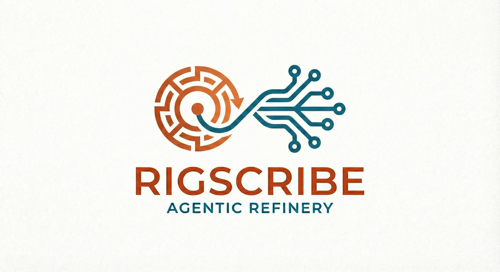

# RigScribe

**Automated Prompt Engineering for Rust**

> **Rig Examples Series: Entry #1**
> This project is the first in a series of examples designed to teach **Agentic AI in Rust**.
> Developed under the mentorship of [Joshua Mo](https://github.com/joshua-mo-143), maintainer of the **[Rig Framework](https://github.com/0xPlaygrounds/rig)**, this series aims to provide gold-standard implementations for the community. **More examples are coming soon.**

---

### **Current Focus: Auto-Improvement**

This specific example (Entry #1) focuses on **Prompt Auto-Improvement**. It demonstrates how to use agents to refine the very instructions used to drive them.

### **1. The Problem: Prompts are Fragile**

In most AI applications, prompts are treated as static strings of text. They are often guessed, hard-coded, and rarely tested.

This is risky. It is like writing software without a compiler.

### **2. The Solution: Prompts as Code**

**RigScribe** treats prompts like software assets. It separates **what you want** (Human Intent) from **what the AI needs** (Technical Specification).

As the foundation of our series, this project uses Rust's type safety and Agentic workflows to ensure your prompts are robust, reusable, and precise.

---

### **3. How It Works: The "Refinery"**

RigScribe acts as a quality assurance layer for your AI interactions. It transforms vague requests into professional system prompts in three steps:

1. **Raw Input**
You provide a simple, human-readable goal.
* *Example:* "Summarize this text."

2. **Agentic Refinement**
RigScribe hands this goal to a specialized "Expert Agent." This agent automatically:
* Clarifies the instruction.
* Injects structural best practices.
* Removes ambiguity.

3. **Robust Output**
The system returns a high-performance system prompt and caches it. You get state-of-the-art quality without manual engineering.

---

### **4. The Future: Self-Learning**

This is just the beginning. The next phase of our roadmap introduces **Reinforcement Learning (RL)**.

Future versions of RigScribe will:

* **Measure Success:** Track if the AI's output valid (e.g., correct JSON).
* **Adapt:** Automatically rewrite the prompt if it fails.
* **Evolve:** Learn the perfect phrasing for your specific use case over time.

---

### **Contributing**

This is an open-source initiative to demonstrate the power of **Rig** and **Rust**.

Whether you are a prompt engineer, a Rustacean, or an AI enthusiast, your contributions are welcome. Help us build the standard for agentic prompt engineering.
